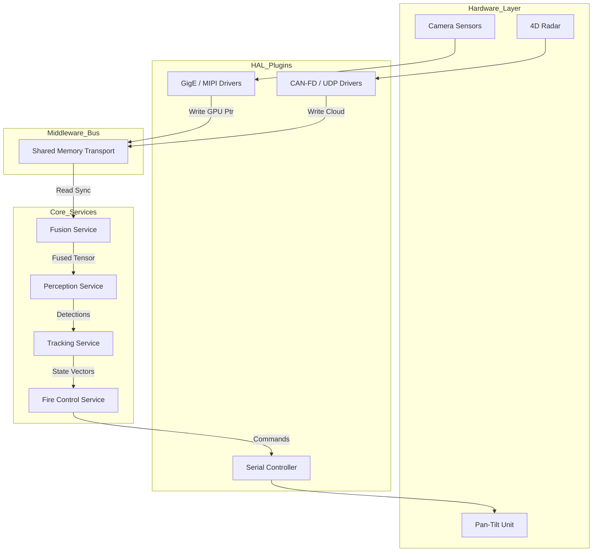

# Aegis Sky Core: The Aura Perception Engine

**Current Version:** 3.1.0-alpha
**Target Platform:** NVIDIA Jetson AGX Orin (JetPack 6.0 / L4T 36.3)
**Standard:** C++20 / CUDA 12.2

## Executive Summary

**Aegis Sky Core** is the high-performance embedded software stack powering the **Aegis Sentry** autonomous defense system. It serves as the "brain" of the Sentry pod, responsible for the real-time detection, classification, tracking, and engagement of asymmetric aerial threats, specifically Class 1 and Class 2 Unmanned Aerial Systems (UAS).

The system is architected to solve the **Latency Crisis** in modern air defense. By leveraging a proprietary "Early Fusion" architecture and the internal **xInfer** runtime, Aegis Sky Core achieves a sensor-to-effector loop time of **under 50 milliseconds**, providing a decisive advantage against high-speed FPV (First-Person View) drones and autonomous swarms.

This repository contains the core logic, hardware abstraction layers, and service orchestration modules. It links against the proprietary `xInfer` and `xTorch` libraries for underlying tensor operations.

---

## Architectural Philosophy

The Aegis Sky architecture is built upon three non-negotiable engineering pillars:

### 1. Zero-Copy Data Transport
In high-frequency perception loops, memory bandwidth is the primary bottleneck. Aegis Sky Core enforces a strict Zero-Copy policy:
*   **Direct Memory Access (DMA):** Sensor drivers (GigE Vision, 4D Radar, LiDAR) write raw data directly into pinned (page-locked) GPU memory.
*   **Pointer Passing:** Services do not exchange data objects; they exchange pointers to shared memory ring buffers. A video frame captured by the HAL is read by the Fusion Engine and the Recorder Service simultaneously without a single CPU memory copy.

### 2. Service-Oriented Architecture (SOA)
The system is decomposed into isolated, hot-swappable services that communicate via a high-performance middleware bus. This ensures:
*   **Fault Isolation:** If the Telemetry Service crashes, the Fire Control Service continues to function.
*   **Hardware Agnosticism:** The Fusion Service communicates with an abstract `ICamera` interface. The underlying implementation (Basler GigE vs. NVIDIA Argus) is loaded as a dynamic plugin at runtime based on configuration.

### 3. Deterministic Execution
To guarantee engagement safety, the system must operate deterministically.
*   **Real-Time Scheduling:** Critical threads (Fusion, Tracking) run with `SCHED_FIFO` Linux priority to preempt standard OS tasks.
*   **Static Allocation:** All critical memory structures (Tensor buffers, Track lists) are pre-allocated at boot time. No `malloc` or `new` operations occur inside the "Hot Loop."

---

## System Architecture Diagram

The data flow follows a strictly defined pipeline from hardware ingestion to kinetic response.



---

## Repository Structure

The codebase adheres to a strict separation between **Public Contracts** and **Private Implementation**. This allows the Core Engine to scale to millions of lines of code while maintaining clean dependency graphs.

### `include/aegis/` (The Public Contract)
This directory contains only header files (`.h`). It defines *what* the system does, but not *how*. Other modules rely solely on these files.
*   **`core/`**: Fundamental types, logging interfaces, and error handling definitions.
*   **`hal/`**: Pure virtual interfaces for hardware (e.g., `ICamera`, `IRadar`, `IEffector`). Any sensor vendor must implement these interfaces to be compatible with Aegis Sky.
*   **`messages/`**: Data Transfer Objects (DTOs) used for inter-service communication. These are aligned with Flatbuffers/Protobuf definitions.
*   **`math/`**: Optimized linear algebra structures (Matrix4x4, Quaternion) used for coordinate transformations.

### `src/` (The Private Implementation)
This directory contains the source code (`.cpp`) and internal logic.
*   **`platform/`**: Low-level OS wrappers for Linux/Jetson (Memory allocators, Thread scheduling, PTP Time synchronization).
*   **`middleware/`**: Implementation of the Inter-Process Communication (IPC) bus and shared memory managers.
*   **`drivers/`**: The implementation of the HAL interfaces. Each folder here (e.g., `drivers/cameras/gige_basler`) compiles into a separate shared object (`.so`) plugin.
*   **`services/`**: The core business logic:
    *   **`fusion/`**: Contains the CUDA kernels for projecting 3D radar points onto 2D image planes.
    *   **`perception/`**: Wraps the `xInfer` runtime to execute TensorRT engines.
    *   **`tracking/`**: Implements Extended Kalman Filters (EKF) and data association algorithms (Hungarian/Munkres).
    *   **`fire_control/`**: Ballistics solvers and Rules of Engagement (ROE) safety checks.

---

## Core Dependencies

Aegis Sky Core is the application layer. It relies on the **Ignition AI** infrastructure stack for deep learning capabilities.

1.  **xInfer (Runtime):** The proprietary high-performance inference engine. Aegis Sky links against `libxinfer.so` to load and execute fused neural network models.
2.  **xTorch (Training):** The C++ training library. Used primarily in the "Online Learning" module to update model weights based on field data.
3.  **CUDA Toolkit (12.x):** Required for all sensor processing and fusion kernels.
4.  **TensorRT (8.x):** Backend for the `xInfer` builder.
5.  **OpenCV (4.x with CUDA):** Used for legacy image handling and visualization (not used in the critical path).

---

## Build Instructions

The project uses CMake with a modular target system.

### Prerequisites
*   Ubuntu 22.04 LTS (or Jetson Linux)
*   GCC 11+ or Clang 14+
*   Ninja Build System

### Compilation Steps

1.  **Configure the Build:**
    Select the target platform. Use `x86_64` for simulation or `JETSON_ORIN` for hardware deployment.
    ```bash
    cmake -B build -G Ninja \
        -DCMAKE_BUILD_TYPE=Release \
        -DAEGIS_PLATFORM=JETSON_ORIN \
        -DCMAKE_PREFIX_PATH="/opt/ignition/xinfer;/opt/ignition/xtorch"
    ```

2.  **Build the Core & Plugins:**
    ```bash
    cmake --build build --parallel $(nproc)
    ```

3.  **Install System-Wide:**
    This installs the binaries to `/usr/local/bin` and plugins to `/usr/local/lib/aegis/plugins`.
    ```bash
    sudo cmake --install build
    ```

---

## Usage & Configuration

The system is data-driven. Behavior is defined by YAML configuration files located in `configs/`.

### Running in Simulation Mode
To test the logic without physical hardware, use the Replay Driver plugin.
```bash
aegis_core --config configs/simulation/scenario_desert_swarm.yaml
```
*Note: This will load pre-recorded sensor logs from `data/logs/` and inject them into the fusion engine.*

### Running in Deployment Mode
For live operations on the Jetson AGX Orin:
```bash
sudo aegis_supervisor --config configs/deployment/base_defense_v1.yaml
```
*Note: `sudo` is required to access GPIO pins (for the effector) and to set `SCHED_FIFO` thread priorities.*

---

## Legal & Compliance

**Copyright © 2025 Aegis Sky, Inc.**

**Proprietary & Confidential**
This source code is the sole property of Aegis Sky, Inc. Any reproduction, distribution, or reverse engineering of the software architecture, fusion algorithms, or driver implementations without express written permission is strictly prohibited.

**Export Control Notice**
This software may be capable of controlling defense articles. It is subject to the export control laws of the United States (ITAR) and/or applicable international arms regulations. Transfer of this source code to foreign nationals or entities may require a valid export license.

**Maintenance**
Maintained by the Aegis Sky Advanced Projects Group (Skunkworks).
